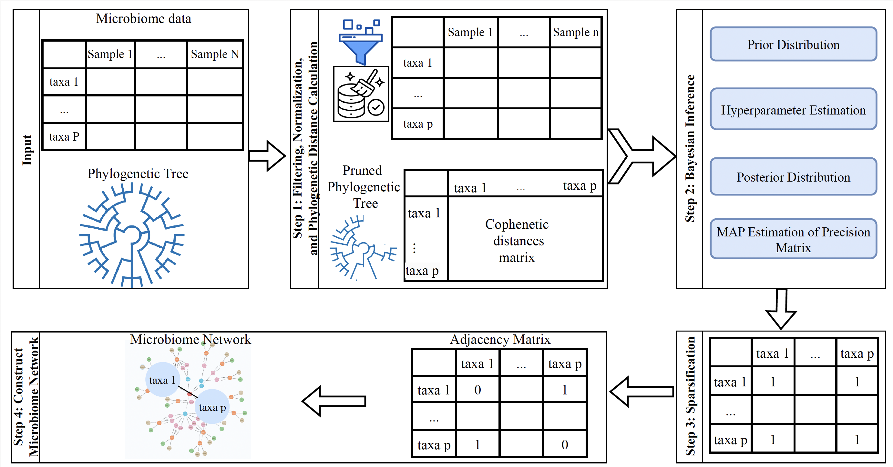

## PhyMapNet: A Phylogeny-Guided Bayesian Framework for Reliable Microbiome Network Inference


[](https://github.com/solislemuslab/CMiNet/blob/main/LICENSE)
[](https://github.com/solislemuslab/CMiNet/issues)

[](https://github.com/solislemuslab/CMiNet/releases)
[](https://doi.org/10.5281/zenodo.17459775)

## Description
<div align="justify">
  
**PhyMapNet** is a Bayesian Gaussian Graphical Model framework for inferring microbiome interaction networks that explicitly integrates phylogenetic information. By incorporating evolutionary distances through kernel-based priors, PhyMapNet embeds biological structure directly into precision matrix estimation, enabling robust inference of conditional dependencies among microbial taxa. To reduce sensitivity to hyperparameter choices, PhyMapNet constructs reliability-driven consensus networks by aggregating results across a large hyperparameter ensemble, yielding stable and interpretable microbiome networks with controllable sparsity. The method is computationally efficient and supports multiple normalization strategies, making it suitable for real-world, high-dimensional microbiome datasets.
</div>

**Figure overview**. PhyMapNet takes normalized microbiome count data and phylogenetic relationships as input, embeds evolutionary structure into a Bayesian graphical model, and infers sparse microbial interaction networks. To ensure robustness, the procedure is repeated across multiple hyperparameter settings, and a stable consensus network is selected based on predefined criteria.

## Installation
```bash
# install devtools if needed
install.packages("devtools")

# install phymapnet from GitHub
devtools::install_github("rosaaghdam/PhyMapNet")
```
## Dependencies
If required packages are missing, install them manually:
```bash
install.packages(c("ape", "GMPR", "compositions"))
```


## Running CMiNet Package
<div align="justify">
The package provides two main analysis functions:

1. **phymapnet_fit()**:  Fit a single PhyMapNet model and return a sparse network.

2. **phymapnet_reliability()**: Run an ensemble across hyperparameters and compute edge reliability and a consensus network.

</div>

### phymapnet_fit(): single-model inference
### Inputs
otu: samples × taxa abundance matrix (rownames = samples, colnames = taxa)
tree: phylogenetic tree (ape::phylo) with tip.label matching taxa names
### Output
precision_map: estimated precision matrix
adjacency: binary network (0/1)
threshold: sparsification threshold used
```
### Define the parameter on all Algorithms
We designed the package to allow users to adjust the default parameters of each algorithm according to their preferences and specific research needs.
- sparcc_params = list(imax = 20, kmax = 10, alpha = 0.1, Vmin = 1e-4)
- spiecEasi_mb_params= list(method = 'mb', lambda.min.ratio = 1e-2, nlambda = 15, pulsar.params = list(rep.num = 20, ncores = 4))
- spiecEasi_glasso_params =params = list(method = 'glasso', lambda.min.ratio = 1e-2, nlambda = 15, pulsar.params = list(rep.num = 50))
- spring_params = list(Rmethod = "original", quantitative = TRUE, ncores = 5, lambdaseq = "data-specific", nlambda = 15, rep.num = 20)
- gcoda_params = list(counts = FALSE, pseudo = 0.5, lambda.min.ratio = 1e-4, nlambda = 15, ebic.gamma = 0.5)
- c_MI_params = list(quantitative = TRUE, q1 = 0.7, q2 = 0.95)
- cclasso_params = list(counts = FALSE, pseudo = 0.5, k_cv = 3, lam_int = c(1e-4, 1), k_max = 20, n_boot = 20)
### Construct weighted network by CMiNet Function
- Description: The CMiNet function constructs a consensus network from microbiome data by integrating multiple network construction algorithms. This approach combines individual microbial association networks into a single weighted network, enhancing reliability by leveraging the strengths of each method.
- Parameters:
  - data: The input microbiome abundance matrix, where rows represent samples and columns represent taxa.
  - quantitative (default = TRUE): Set to TRUE if the data contains quantitative abundance counts; set to FALSE otherwise.
  - TT: The threshold value used for threshold-dependent algorithms (pearson, spearman, bicor, SparCC, and CCLasso), set to the 0.95 quantile by default to promote sparsity in the consensus network.
  - Algorithm-Specific Parameters:
    - pearson, spearman, bicor: Boolean flags to enable these correlation-based methods. When set to TRUE, the algorithm runs on the data; when set to FALSE, it is excluded from the analysis.
    - SparCC, SpiecEasi_mb, SpiecEasi_glasso, SPRING, gCoda, c_MI, CCLasso: Lists of parameters for each algorithm, allowing customization of settings such as number of cores (ncores), threshold values (lambda.min.ratio), and other algorithm-specific configurations.
    - Setting the enabled parameter to TRUE for an algorithm will include it in the consensus network construction, while setting it to FALSE will skip the algorithm, allowing users to select a subset of methods for analysis.
- Returns: A list containing:
  - weighted_network: A weighted network matrix representing the consensus network.
  - edge_list: edge_list: A matrix with four columns—the first and second columns indicate node IDs, the third column represents the edge weight values, and the fourth column specifies the name of the method that confirmed the appearance of the edge.
  - errors: Any errors from algorithms that could not run on the data, providing feedback for troubleshooting.
```bash
sparcc_params = list(imax = 20, kmax = 10, alpha = 0.1, Vmin = 1e-4)
spiecEasi_mb_params= list(method = 'mb', lambda.min.ratio = 1e-2, nlambda = 15, pulsar.params = list(rep.num = 20, ncores = 4))
spiecEasi_glasso_params =params = list(method = 'glasso', lambda.min.ratio = 1e-2, nlambda = 15, pulsar.params = list(rep.num = 50))
spring_params = list(Rmethod = "original", quantitative = TRUE, ncores = 5, lambdaseq = "data-specific", nlambda = 15, rep.num = 20)
gcoda_params = list(counts = FALSE, pseudo = 0.5, lambda.min.ratio = 1e-4, nlambda = 15, ebic.gamma = 0.5)
c_MI_params = list(quantitative = TRUE, q1 = 0.9, q2 = 0.95)
cclasso_params = list(counts = FALSE, pseudo = 0.5, k_cv = 3, lam_int = c(1e-4, 1), k_max = 20, n_boot = 20)
```


```bash
result <- CMiNet(
  data,
  quantitative = TRUE,
  TT = 0.95,
  pearson = list(enabled = TRUE),
  spearman = list(enabled = TRUE),
  bicor = list(enabled = TRUE),
  sparcc = list(enabled = TRUE,params=sparcc_params),
  spiecEasi_mb = list(enabled = TRUE,params = spiecEasi_mb_params),
  spiecEasi_glasso = list(enabled = TRUE,params = spiecEasi_glasso_params),
  spring = list(enabled = TRUE,params = spring_params),
  gcoda = list(enabled =TRUE, params =gcoda_params),
  c_MI  = list(enabled =TRUE,params=c_MI_params),
  cclasso = list(enabled = TRUE,params=cclasso_params)
)
```
## process_and_visualize_network Function:
- Description: The process_and_visualize_network function processes a weighted microbiome network and visualizes it across specified thresholds. Each threshold filters edges based on minimum weight, helping to analyze network structure at varying levels of connectivity.

- Parameters:
  - weighted_network: The input weighted network matrix generated by the CMiNet function.
  - taxa_names: Vector of taxa names for labeling nodes in the network.
  - thresholds: A vector of threshold values defining minimum edge weights for inclusion in the network plot.
  - show_labels: Boolean vector indicating whether to display taxa names for each threshold (e.g., TRUE or FALSE).
  - node_colors: Vector of colors for nodes in each threshold-based plot.
  - edge_colors: Vector of colors for edges in each threshold-based plot.
- Returns:
A set of network plots for each threshold, visualizing taxa relationships based on edge weights. Each plot includes details on the number of nodes and edges in the network, and also the maximum degree value .
```bash
weighted_network = result$weighted_network
taxa_names <- taxa_name[, 2]
rownames(weighted_network) = colnames(weighted_network)=taxa_names
thresholds <- c(max(weighted_network)-1,max(weighted_network)-2,max(weighted_network)-3,max(weighted_network)-4)  # Thresholds for visualization
show_labels <- c(FALSE, FALSE, FALSE, FALSE)  # Show taxa names (TRUE/FALSE) for each threshold
node_colors <- c("white", "lightyellow",  "lightgreen","lightblue")  # Node colors for each threshold
edge_colors <- c("blue", "#9491D9", "#332288", "purple")  # Edge colors for each threshold
process_and_visualize_network(weighted_network, taxa_names, thresholds, show_labels, node_colors, edge_colors)
```


## plot_hamming_distances Function
- Description:
The plot_hamming_distances function calculates the Hamming distance, number of common edges, and total edges for each pair of network matrices. It generates a plot to visualize these distances, providing insights into structural differences between networks generated by different algorithms or parameters.

- Parameters:
  - network_type (e.g., "Binary_Network"): The directory or folder where all the binary network matrices are saved.
  - top_n_pairs: An integer specifying the top number of network pairs to display based on the smallest Hamming distances.
  - output_filename: The filename for saving the Hamming distances plot as an image file.
- Returns:
A plot visualizing the Hamming distances between selected network pairs. The plot is optionally saved as an image file to the specified output_filename.

```bash
plot_hamming_distances("Binary_Network", top_n_pairs = 10, output_filename = "hamming_distances_plot.jpeg")
```


## plot_network Function
- Description:
The plot_network function generates a visual representation of the final consensus network by applying a score threshold. This threshold filters the network to display only the most significant edges, allowing users to examine the core structure of the microbiome network based on selected nodes and edges.

- Parameters:
  - network_final: A binarized network matrix derived from the weighted consensus network. The matrix is filtered based on a numeric Score threshold, where only edges with weights above this threshold are included.
  - node_color: Specifies the color for nodes in the plot.
  - edge_color: Specifies the color for edges in the plot.
  - label_color: Specifies the color for node labels in the plot.
- Returns:
A figure displaying the final microbiome network, filtered by the score threshold. Nodes, edges, and labels are color-coded according to the specified parameters, providing a clear view of significant interactions within the network.
```bash
WN = result$weighted_network
taxa_names <- taxa_name[, 2]
rownames(WN) = colnames(WN)=taxa_names
score = max(WN)-3
network_final <- ifelse(WN > score, 1, 0)
network_final[lower.tri(network_final)] <- 0  # Only upper triangle will have non-zero values
sum(network_final)
plot_network(network_final, node_color = "skyblue", edge_color = "grey", label_color = "black")
```


You can print the original and formatted taxa names using the following command:
```bash
print(taxaname)
```
## Notes on CMiNet Integration 
The bootstrap workflow is **not currently included in the public CMiNet pacakge and Shiny app** because of runtime constraints on our server. Running many bootstrap replicates interactively would exceed available compute capacity and make the app unresponsive.

On higher-capacity hardware, the full bootstrap analysis could be performed interactively without difficulty.

For now, we provide the workflow as a **standalone R script** in the `cminet_bootstrap.R` file. Users can run it offline with control over the key parameters:

- **B**: number of bootstrap replicates  
- **m0**: within-replicate support threshold  
- **m\***: frequency threshold on the original data  
- **c\***: bootstrap confidence threshold  

This script produces edge-level reproducibility measures and joint filtering results, consistent with the consensus rule described in the manuscript.

We plan to include **native Shiny app integration in CMiNet v2**, once sufficient computing resources are available.

## Reporting Issues and Asking Questions

If you encounter a bug, experience a failed function, or have a feature request, please open an issue in the GitHub [issue tracker](https://github.com/solislemuslab/CMiNet/issues). 

## License

CMIMN is licensed under the [GNU General Public License v3.0 (GPL-3)](https://www.gnu.org/licenses/gpl-3.0.html). &copy; Solis-Lemus Lab (2024).


## Citation

If you use PhyMapNet in your work, we kindly ask that you cite the following paper:

```bibtex
@article{shahdoust2025simmapnet,
  title={SimMapNet: A Bayesian Framework for Gene Regulatory Network Inference Using Gene Ontology Similarities as External Hint},
  author={Shahdoust, Maryam and Aghdam, Rosa and Sadeghi, Mehdi},
  journal={bioRxiv},
  pages={2025--04},
  year={2025},
  publisher={Cold Spring Harbor Laboratory}
}


```
